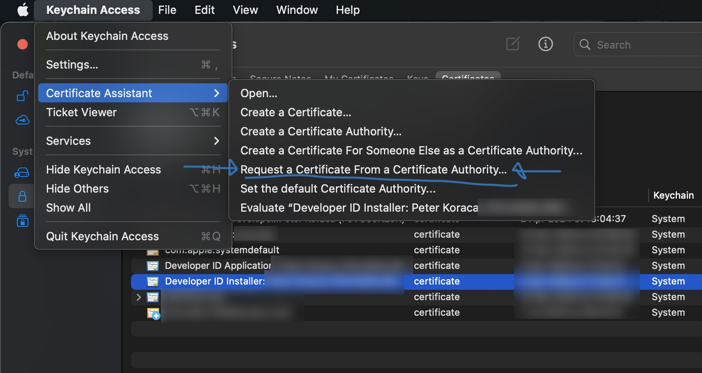
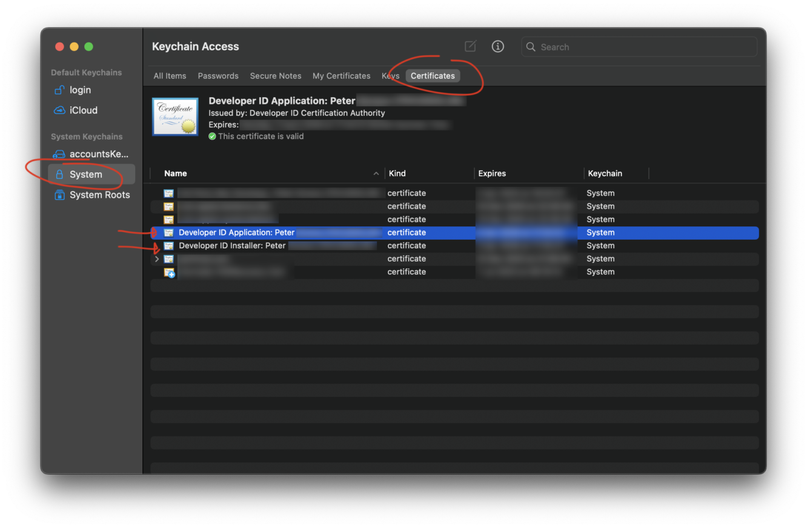

# How to package, code-sign, notarize and share an electronJS app for mac-os in 2023

[Peter Koraca,](https://www.peterkoraca.com) 6th of April 2023.

Building prototypes and apps is fun. Dealing with certificates and provisioning admin is not. I've written this guide for anyone going through the same frustrations as me, trying to package up, code-sign, notarize and share a Vue.js + Electron.js app on a Mac-os (Ventura 13.3). I hope it helps.

The original article can be found on my [blog.](https://www.peterkoraca.com/blog)

## Process Overview

1. Building your app
2. Apple Developer Programme Certificates – Requesting, Generating, Creating, Downloading and Installing
3. Configuring **electron-builder**
4. Packaging, Signing and Notarizing the app
5. Share/Distribute the app

## Process Details

### 1. Building your app – The easy part

1. Build your Vue/React/[Insert your framework here] app. The files should be neatly packaged in the `dist` folder now (unless you've got some other configuration going on).
2. Make sure your Electron.JS app works, and runs as expected when you run `npm run start`

### 2. Apple Developer Programme Certificates – Requesting, Generating, Creating, Downloading and Installing

1. Register for [Apple Developer Programme](https://developer.apple.com)

2. Download, Install & Run XCode (sign in to your account there). I've created a few native apps for both Mac and ios before, so XCode has already downloaded some of the developer, provisioning and distribution profiles. You might need to create those manually. or build some sample apps.


3. Create certificate signing requests using keychain assistant. You will need to create two: one for your **developer id application**, and one for your **developer id installer** certificates.

4. Open the Keychain Access app

5. Open Certificate Assistant -> Request a Certificate From a Certificate Authority



6. Enter your Apple ID email in the User Email Address field, and type your name+surname in the Common Name field. Leave the CA email address field empty. Save the file to disk.


7. Repeat step 4 and 5 so that you have **two** Requests for certificates (for both application and installer certificates). You will need them later.

8. Log in to your Apple developer account at [developer.apple.com](https://developer.apple.com/account/resources/certificates/list)

9. Scroll down and note down your **Team ID.** You will need it later.


10. Go to Certificates, Identifiers & Profiles and click on the blue + icon


11. Request a **Developer ID Application certificate** and **Developer ID Installer certificate.** You'll have to do each one at a time.


12. Select the G2 Sub-Ca profile type and upload the certificate signing request you created earlier.


7. Download the certificates to your computer & Install them (double click them in finder).

You should see everything in your Keychain Access app under System/Certificates if all goes well.



### 3. Configuring Electron Builder

1. Install [electron-builder](https://github.com/electron-userland/electron-builder)

2. Add an [entitlements](entitlements.plist) file to your project

3. Add the app-specific info to your **package.json** file

[](package-json.jpg)

Your package.json should have a **build** section. This will tell electron builder how to package up your app.
Here's what I have in mine (replace the APP_NAME with your actual app name).
The app category has to be one of Apple’s from their [documentation.](https://developer.apple.com/library/archive/documentation/General/Reference/InfoPlistKeyReference/Articles/LaunchServicesKeys.html#//apple_ref/doc/uid/TP40009250-SW8)

```json
"build": {
   "appId": "com.peterkoraca.APP_NAME",
   "productName": "APP_NAME",
   "icon": "dist/Icon",
   "directories": {
      "output": "releases/${platform}/${arch}"
   },
   "mac": {
      "hardenedRuntime": true,
      "gatekeeperAssess": false,
      "entitlements": "./entitlements.plist",
      "entitlementsInherit": "./entitlements.plist",
      "category": "public.app-category.developer-tools"
   }
},
```

The scripts section in your **package.json** should have the electron builder in there.

```json
"scripts": {
   "dev": "vite",
   "build": "vite build",
   "preview": "vite preview",
   "start": "electron .",
   "dist": "electron-builder"
},
```

### 4. Packaging, Signing and Notarizing the app

11. You can now run `npm run dist` to get the electron-builder to package AND sign your app.

The builder will find your application certificate+developer profile and "automatically" sign the binary created. This might take a while.

11.5 Create a ZIP file of your app. You'll need it when we get to notarization.

At this point, **you have a signed binary, a zipped file of your binary, but it still needs to be Notarized!**

12. You will need to notarize the binary before you can share it. Head over to [Apple ID](https://appleid.apple.com/) **not the Developer portal!** and find a button called "App Specific Passwords".

13. Create an app-specific password for your app (you will need this in the next step when we notarize the app). Copy and paste the generated code, as it will only be shown to you once.


14. Store the information acquired in a profile notary tool that can use. The tool will ask you for a **profile name** note this down as you will need it in the next step.

```bash
$ xcrun notarytool store-credentials --apple-id "YOURAPPLE_ID@EMAIL.COM" --team-id "YOUR_TEAM_ID"
```

13. Submit & Notarize your app with Apple's **notarytool** This process might take some time.

```bash
$ xcrun notarytool submit yourapp.zip --keychain-profile "YOUR_PROFILE_NAME" --wait
```

You should now have a signed and notarized app if all goes well.

14. Attach the notarization info to the app with the following:

```bash
$ xcrun stapler staple YOUR_APP.app
```

15. If all goes well you should be able to run the following check and receive the following:

```bash
$ spctl --assess -vv --type install YOUR_APP.app

youarapp.app: accepted
source=Notarized Developer ID
            origin=Developer ID Application: YOUR_NAME/TEAM_ID
```

## Most common errors when things don't go well 🤬

You're mostly on your own, but here are some of my learnings.

- **electron-forge** with `osxSign` and `osxNotarize` sections in its config didn't work for me. It would keep erroring out at the notarization stage where Apple would return an error saying that the app doesn't have a valid certificate signature. I now use electron-packager instead.
- **manually created and installed certificates** (as described above) helped with the signing and packing procedure. As mentioned, I already had the developer, provisioning and distribution profiles installed, so you might need to create those manually.
- **blank page/page not loading** once you're app is built and ran. There's most likely something wrong with your paths (where you specify which script to run or injest). For the sake of simplicity, I've got all of my main scripts and the entitlements file in the root directory.

```
myApp/
      package.json
      electron-main.js --- the file that electron starts with
      electron-preload.js --- the injested file
      entitlements.plist --- the entitlements file apple requires
      dist/ --- where the vue.js built stuff lives

```

In my electron-main script I then link to the relevant injsted file like this:

```js
const indexURL = path.resolve(__dirname, "dist/index.html");
const preloadPath = path.resolve(__dirname, "electron-preload.js");
```

Hope this helps

## Share/Distribute the app

Now you're ready to share your app with others without it getting immediately blocked and hidden in the system settings privacy section.

Good luck 🤗

[Peter Koraca,](https://www.peterkoraca.com) 6th of April 2023.
